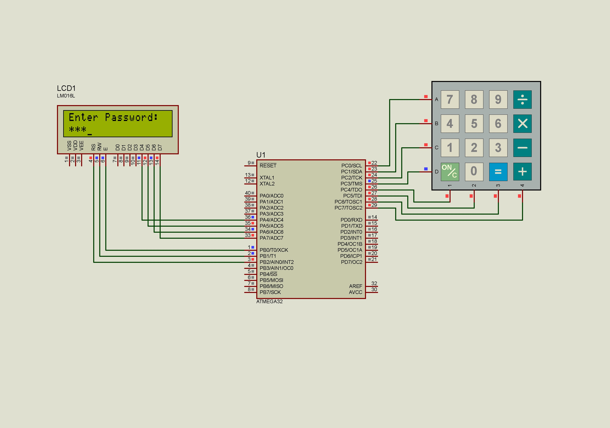

<h1>Electronic Private Safe System Project</h1>
<h3>Iam Ezz Edin and this is my embedded systems project on AVR-based Micro-controller (ATMega32)</h3>

You can find the following files in the repo: 

<ol>
  
Digital input output drivers for interfacing with ATMega32:

  <li>DIO.c</li>
  <li>DIO.h</li>
</ol>
 
<ol start='3'>
  
Drivers for interfacing with LM016(2*16) Hitachi LCD:

  <li>LCD.c</li>
  <li>LCD.h</li>
</ol>
 
<ol start='5'>
  
keypad configuration functions:

  <li>keypad.c</li>
  <li>keypad.h</li>
</ol>
 
<ol start='7'>
  
EEPROM configuration functions:

  <li>EEPROM.c</li>
  <li>EEPROM.h</li>
</ol>
 
<ol start='9'>
  
Main Program File for the Project:

  <li>PrivateSafe.c</li>
  <li>Project.pdsprj</li>
</ol>

<pre>
  You can find also output files for the project in the debug folder including
  Assembly(.lss) and (.hex) file to be Embedded in MicroController ROM.
  I use ATMEL STUDIO so you can also find project files.
</pre>
<h2>Thank you.</h2>
 
